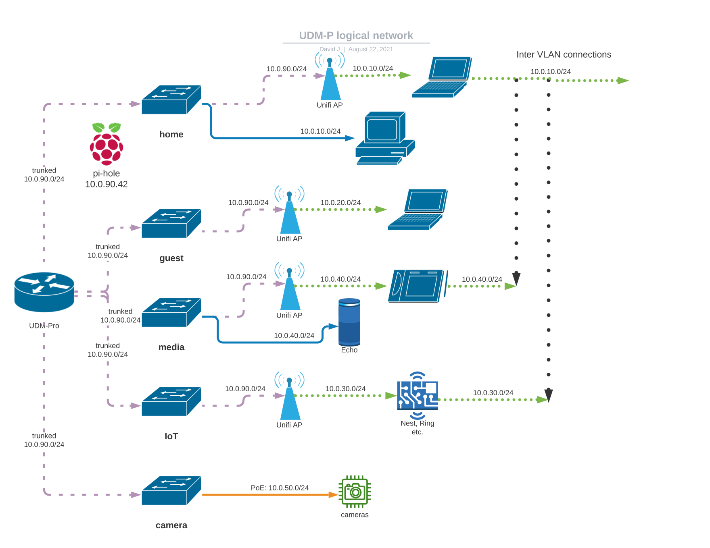

# Prosumer network configuration using Unifi/Ubiquiti gear

[Ubiquiti](https://www.ui.com/) is a creative and proliferate producer of really cool networking gear
at reasonably attractive prices.
But what they are ahead in hardware and software, they lack on documentation.
The basics are documented in their help pages, but many of the more involved
networking configurations have gaps.

This repo was initially intended to capture and document my own home network's configuration. Hope is, this
will also help others in their quest for a more solid networking experience.

## Goals

- run a reliable, secure and well performing home network with little complaints from my customer base (aka spouse & family)
- design with Principle of Least Privilege (PoLP).
  One definition by [NIST, see page 91](https://nvlpubs.nist.gov/nistpubs/SpecialPublications/NIST.SP.800-12r1.pdf)
- keep my customer base reasonably sheltered from online privacy mining and spying.
- allow me to tinker and learn, hence this network setup is indeed over-engineered.
  A simple modern ISP's router & gateway could get the basic job done (but would be less fun to interact with).

## Design choices

Disclaimer: I have no relationship with, no sponsoring from nor financial interests in Ubiquiti,
I'm just a mostly happy customer of their products.

About ~10 years ago, I discovered Ubiquiti's prosumer networking hardware that is indeed disruptive,
for the price they are able to offer their hardware. My journey with UI started with just an AP or 2,
combined with an EdgeRouterLite 3, adding a couple PoE capable switches to it over time.
This summer I finally took the plunge to replace my ERL3 (which started to exhibit some
thermal stability issues) with the UDM Pro [Unifi Dream Machine Pro](https://www.ui.com/consoles/)

### Basic topology

This is the current physical wired topology, with the UDM-Pro as the gateway,
and one PoE-enabled UI switch on each floor. House ethernet wiring is good for up to 1 Gbit/s,
with all runs made in CAT5e; same for patch cables.


### Network segmentation

Following the Least Privilege principle, the LAN is separated into multiple logical segments, using
VLANs:
| VLAN | CIDR | Medium | SSID | Purpose |
| ---: | ---: | ------ | ---- | ------- |
| 1  | 10.0.90.0/24 | Wired 1GbE | n/a | backhaul, management |
| 10 | 10.0.10.0/24 | Wired/Wireless | jenni.ap | trusted home net |
| 20 | 10.0.20.0/24 | Wireless | jenni.guest | guests, internet only |
| 30 | 10.0.30.0/24 | Wireless | jenni.iot | IoT devices, internet only |
| 40 | 10.0.40.0/24 | Wireless | jenni.media | media devices, internet only |
| 50 | 10.0.50.0/24 | Wired | n/a | PoE camera devices, no internet |

For my network, I chose ranges from the 10/8 private address space, feel free to pick different ranges
from [RFC1918](https://datatracker.ietf.org/doc/html/rfc1918), e.g. from the 172.16/12 or 192.168/16 ranges.
I find it useful to reflect the sub range, e.g. ```.10.*```, to also be the VLAN id, but there is no
technical need to do so.

Note the 5 switches shown below are purely logical; the physical HW has the UDM and the 2 switches above.
By default, the UDM Pro allows full inter-VLAN access, but this site's configuration will by default block
any inter-VLAN connectivity, and only allow the trusted ```home (10)``` VLAN to initiate connections to the
```IoT (30)``` and ```media (40)``` VLANs. Access from/to the ```management (1)``` LAN and trunk is
not allowed from any VLAN; sole exception is allowing access to the UDM-P itself from the ```home (10)``` (10.0.10.1).

Details see [Firewall](#Firewall)


diagram created with: <https://lucid.app/documents/view/2e7294c0-6628-45b6-8b2d-1b2a5b47b208>

## Configuration

- [Initial Setup of UDM-Pro](/configuration/1-UDM-Pro-Setup.md)
- [Backhaul: Switches, AccessPoints](/configuration/2-Backhaul-switches-APs.md)
- [Define networks](/configuration/3-Networks.md)
- [Define WiFi](/configuration/4-Wifi.md)
- [Firewall groups and rules](/configuration/5-Firewall-rules.md)
- [Cloudflare tunnel to LAN](configuration\6-Cloudflare-tunnel.md)
